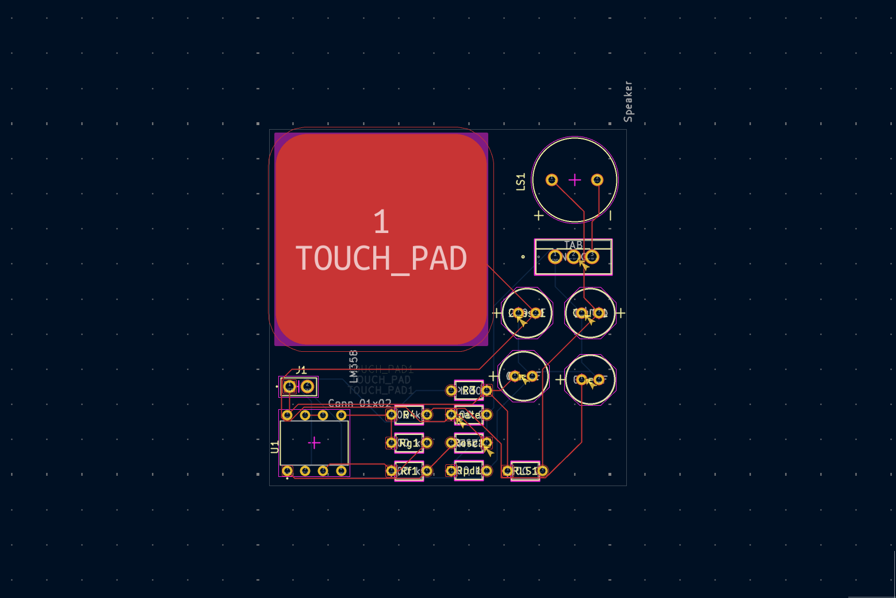
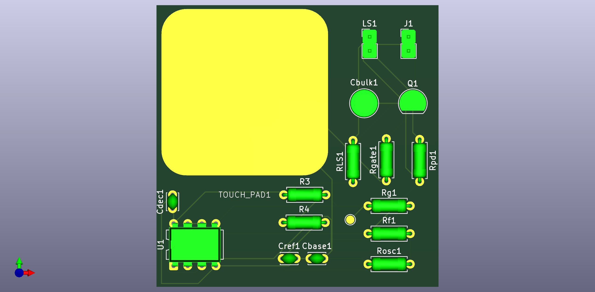
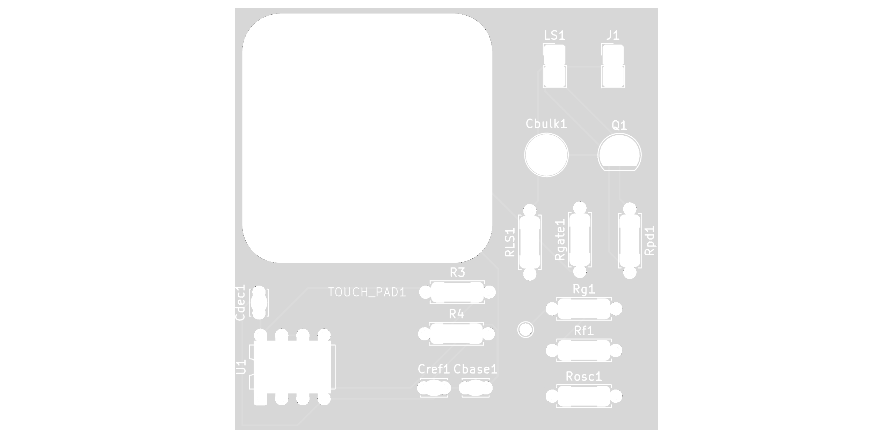

# Mini-Theremin

A Mini-Theremin PCB designed as part of an electronics course project. A theremin is a musical instrument played without physical contact — this compact version uses a capacitive touch pad to control audio frequency through a Schmitt Trigger oscillator.

## How It Works

The Mini-Theremin uses a copper touch pad as one half of a capacitor. When you bring your hand near or touch the pad, you change the system's capacitance, which alters the oscillation frequency of a Schmitt Trigger oscillator built around an LM358 op-amp. The oscillator output drives a 2N7000 MOSFET that switches a speaker on and off at the oscillation frequency, producing an audible tone. Moving your hand closer to the pad lowers the pitch; moving it away raises it.

## 3D Board View

## Completed Build

| Front | Back |
|-------|------|
|  |  |

## Bill of Materials

| Reference | Qty | Value | Component |
|-----------|-----|-------|-----------|
| Cbase1 | 1 | 220 pF | Base capacitor |
| Cbulk1 | 1 | 10 uF | Bulk decoupling capacitor |
| Cdec1, Cref1 | 2 | 0.1 uF | Decoupling/reference capacitors |
| J1 | 1 | Conn_01x02 | 2-pin power connector |
| LS1 | 1 | Speaker | Piezo speaker |
| Q1 | 1 | 2N7000 | N-channel MOSFET |
| R3, R4, Rg1, Rpd1 | 4 | 100 kOhm | Resistors |
| Rf1 | 1 | 200 kOhm | Feedback resistor |
| Rgate1, RLS1 | 2 | 100 Ohm | Gate/load resistors |
| Rosc1 | 1 | 2.2 MOhm | Oscillation resistor |
| TOUCH_PAD1 | 1 | TOUCH_PAD | 30x30mm capacitive touch pad |
| U1 | 1 | LM358 | Dual op-amp (Schmitt trigger) |

## Files

- `Theremin.kicad_sch` - KiCad schematic
- `Theremin.kicad_pcb` - KiCad PCB layout
- `Theremin.kicad_pro` - KiCad project file
- `240Library/` - Custom component library (footprints and symbols)
- `Therminim.pretty/` - Custom touch pad footprint
- `PCB_Lab_Report.pdf` - Lab report with design documentation
- `*.gbr` / `*.drl` - Gerber files and drill files for manufacturing

## Software

Designed in [KiCad 9.0](https://www.kicad.org/).
